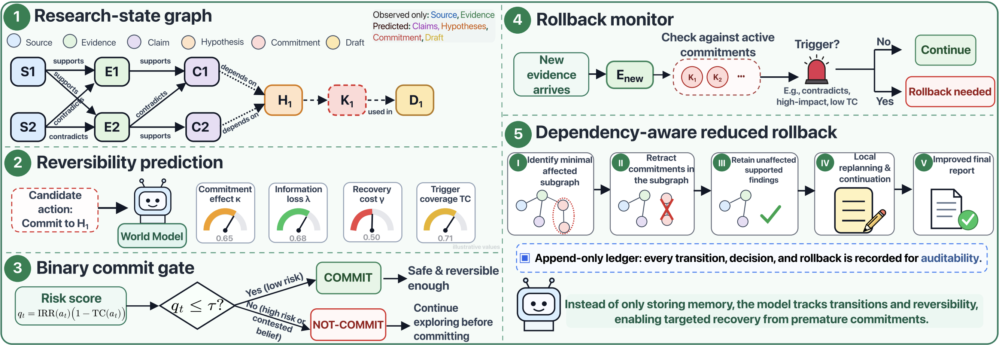

# DeepRewind (REALM@EMNLP 2026)

> Predicting and Repairing Premature Commitments in Deep Research Agents.
> Built as an additive control layer on top of [langchain-ai/open_deep_research](https://github.com/langchain-ai/open_deep_research).



Deep-research agents conduct long-horizon investigations through iterative search, evidence evaluation, belief revision, and synthesis, but they can commit to claims before sufficient evidence is available, letting later reasoning reinforce an incorrect interpretation. DeepRewind represents an agent's evolving epistemic state as a typed graph of sources, evidence, claims, hypotheses, assumptions, commitments, plans, and drafts. Before an intermediate conclusion is accepted, a prompt-based world model predicts its effect on that graph and estimates its reversibility; a binary controller blocks risky commitments, and a consistency monitor performs dependency-aware rollback when later evidence invalidates one.

Concretely, DeepRewind adds the following on top of the base agent, and nothing in its search/tool-use/report-writing behavior changes unless the control layer decides to intervene:

1. Epistemic graph: a durable, typed record of what the agent knows, believes, assumes, cites, commits to, and writes.
2. Research-state world model: predicts the graph delta of a candidate commitment and estimates its reversibility (hypothesis narrowing, information loss, recovery cost, contradiction-trigger coverage).
3. Reversibility-aware controller: a binary commit / not-commit gate driven by the predicted reversibility risk (threshold or utility mode).
4. Consistency monitor and reduced rollback: detects when new evidence invalidates an accepted commitment and deterministically retracts/regenerates only the affected subgraph.

### 🔥 Base Project Acknowledgment

The core deep research agent — LangGraph orchestration, multi-provider model support, search/MCP tooling — comes from the upstream **[langchain-ai/open_deep_research](https://github.com/langchain-ai/open_deep_research)** project and remains under its original MIT license. Full credit for the base agent goes to the LangChain team and the upstream contributors. DeepRewind is an additive, defensively-wrapped control layer on top of that agent: every recorder, predictor, gate, and rollback component fails silently rather than breaking a run, so the base agent's behavior is unchanged unless the control layer explicitly intervenes.

## 🧠 What DeepRewind Adds

Nothing in the base agent's behavior changes unless the control layer decides to intervene — every recorder/predictor/gate/rollback component is additive, dependency-free, thread-safe, and defensively wrapped so a failure in any of it can never break a run.

### 1. Research state-graph logging (`research_logger.py`)
Records the operational trace of a run — every node the agent enters, the tools it calls, and the transitions between steps — as an append-only JSONL "research graph." Useful for debugging and understanding the control flow of a run. Files are written to `research_logs/` by default.

### 2. Epistemic graph recording (`epistemic_graph.py`)
Records the agent's evolving *epistemic state* — what it knows, believes, assumes, cites, commits to, and writes — as a separate append-only JSONL graph, written to `epistemic_graphs/` by default.

It captures typed **nodes**:

`Source`, `Evidence`, `Claim`, `Hypothesis`, `Assumption`, `Commitment`, `DraftFragment`, `PlanStep`

connected by typed **edges**:

`supports`, `contradicts`, `depends_on`, `compresses`, `used_in`, `derived_from`, `cites`, `revises`, `invalidates`

As the agent researches, retrieved search results become `Source` nodes, compressed findings become `Evidence`, supervisor beliefs become `Hypothesis` nodes (with `revises` edges when a belief is re-formed), findings become `Claim` nodes wired back to the evidence and hypotheses they depend on, sufficiency decisions become `Commitment` nodes, and the final report becomes `DraftFragment` nodes linked (`used_in` / `derived_from`) to the claims and evidence behind them. Invalidated artifacts are marked contested/stale/retracted rather than deleted, preserving the full research history.

### 3. Research-state world model (`world_model.py`, `world_model_encoder.py`, `world_model_scoring.py`)
Before a candidate commitment is accepted, the local epistemic subgraph is serialized (`world_model_encoder.py`) and passed to an LLM world model that predicts the resulting graph delta and reversibility metadata (`kappa`, `lambda`, `gamma`, `theta`, trigger coverage). Grounded structural scores are computed from the graph itself (`world_model_scoring.py`): claim belief, hypothesis plausibility, commitment effect, information loss, recovery cost, and irreversibility risk, which feed a binary commit / not-commit decision in either threshold or utility mode.

### 4. Consistency monitor and reduced rollback (`world_model_monitor.py`, `world_model_rollback.py`)
Every accepted commitment registers a rollback trigger. As new evidence enters the graph, the monitor checks whether the trigger fired and claim belief has fallen below threshold. When it has, DeepRewind deterministically retracts the commitment and its unique justifications, removes commitment-specific dependencies, and marks downstream drafts/plans/hypotheses stale, without any additional model call, while preserving independently-supported findings.

### 5. World-model logging (`world_model_logger.py`)
Append-only JSONL log of every prediction, gate decision, monitor check, trigger fire, and rollback, with a full configuration snapshot, kept separate from the research/epistemic logs.

### 6. Controlled experiment hooks (`experiments/`)
Default-off hooks for injecting provenance-tagged initial evidence (`seed_initial_condition.py`) and mid-run alternative-switching evidence (`switching.py`), plus an orchestrator/analyzer (`orchestrate.py`, `analyze.py`) for running and comparing arms (`base`, `wm_shadow`, `wm_gate`, `wm_rollback`, `ablate_norollback`) across seeds.

### 7. Graph visualization scripts (`scripts/`)
Two standalone renderers turn the JSONL traces into HTML, Graphviz DOT, and Mermaid diagrams:
- `scripts/visualize_research_graph.py` — renders the operational research state graph.
- `scripts/visualize_epistemic_graph.py` — renders the epistemic graph, color- and shape-coded by node/edge type.

See [Graph Visualization](#-graph-visualization) below for usage.

### 8. One-shot console runner (`scripts/run_research.py`)
Runs a single research question end-to-end with the epistemic graph, research logging, and the world-model gate/rollback enabled, then renders both graphs to HTML automatically. See [Running from the Console](#-running-from-the-console-scriptsrun_researchpy) below.

### 🚀 Quickstart

1. Clone the repository and activate a virtual environment:
```bash
git clone https://github.com/AmirAbaskohi/DeepRewind.git
cd DeepRewind
uv venv
source .venv/bin/activate  # On Windows: .venv\Scripts\activate
```

2. Install dependencies:
```bash
uv sync
# or
uv pip install -r pyproject.toml
```

3. Set up your `.env` file to customize the environment variables (for model selection, search tools, and other configuration settings):
```bash
cp .env.example .env
```

4. Launch agent with the LangGraph server locally:

```bash
# Install dependencies and start the LangGraph server
uvx --refresh --from "langgraph-cli[inmem]" --with-editable . --python 3.11 langgraph dev --allow-blocking
```

This will open the LangGraph Studio UI in your browser.

```
- 🚀 API: http://127.0.0.1:2024
- 🎨 Studio UI: https://smith.langchain.com/studio/?baseUrl=http://127.0.0.1:2024
- 📚 API Docs: http://127.0.0.1:2024/docs
```

Ask a question in the `messages` input field and click `Submit`. Select different configuration in the "Manage Assistants" tab.

#### Running with conda instead of `uv`

If you prefer conda (no `uv` required), create an environment, install the package in editable mode, then launch the LangGraph dev server:

```bash
conda create -n deeprewind python=3.11 -y
conda activate deeprewind

# Install this package (and its dependencies) in editable mode
pip install -e .

# Set up your environment variables
cp .env.example .env   # then edit .env to add your API keys

# Launch the LangGraph dev server
langgraph dev --allow-blocking
```

You can also run the agent programmatically from Python (any environment where `pip install -e .` succeeded):

```python
import asyncio
from open_deep_research.deep_researcher import deep_researcher

async def main():
    result = await deep_researcher.ainvoke(
        {"messages": [{"role": "user", "content": "Your research question here"}]},
    )
    print(result["final_report"])

asyncio.run(main())
```

Every run writes an operational log to `research_logs/` and an epistemic graph to `epistemic_graphs/` (unless disabled — see the hyperparameters below). The world model / commitment control layer is off by default; see [Running from the Console](#-running-from-the-console-scriptsrun_researchpy) and the world-model hyperparameters table below to turn it on.

### 🖥️ Running from the Console (`scripts/run_research.py`)

For ad-hoc use outside of LangGraph Studio, `scripts/run_research.py` runs one question end-to-end — research logging, epistemic-graph recording, and the DeepRewind world-model gate/rollback are enabled by default — then renders both graphs to HTML automatically.

```bash
# Full DeepRewind run (world model gates commitments and rolls back stranded ones)
python scripts/run_research.py "What are the tradeoffs of nuclear vs. renewables for net-zero grids?"

# Predict-only (shadow) mode: log world-model predictions but never block or roll back
python scripts/run_research.py "..." --shadow

# Plain Open Deep Research behavior, world model fully disabled
python scripts/run_research.py "..." --disable-world-model

# Utility-mode gate instead of the default threshold mode
python scripts/run_research.py "..." --gate-mode utility

# Skip HTML rendering, or open the rendered graphs in a browser
python scripts/run_research.py "..." --no-visualize
python scripts/run_research.py "..." --open
```

The script prints the final report (also saved under `reports/<thread-id>.md`) along with the paths to the research log, epistemic graph, and world-model log it produced. Run `python scripts/run_research.py --help` for the full flag list (model overrides, `--max-iterations`, `--disable-rollback`, log directories, etc.).

### ⚙️ Configurations

#### LLM :brain:

DeepRewind supports a wide range of LLM providers via the [init_chat_model() API](https://python.langchain.com/docs/how_to/chat_models_universal_init/). It uses LLMs for a few different tasks. See the model fields in [configuration.py](src/open_deep_research/configuration.py) for more details. This can be accessed via the LangGraph Studio UI.

- **Summarization** (default: `openai:gpt-4.1-mini`): Summarizes search API results
- **Research** (default: `openai:gpt-4.1`): Power the search agent
- **Compression** (default: `openai:gpt-4.1`): Compresses research findings
- **Final Report Model** (default: `openai:gpt-4.1`): Write the final report

> Note: the selected model will need to support [structured outputs](https://python.langchain.com/docs/integrations/chat/) and [tool calling](https://python.langchain.com/docs/how_to/tool_calling/).

> Note: You can route OpenAI model calls through OpenRouter while keeping the same model strings (for example `openai:gpt-4.1`). Set:
>
> ```bash
> OPENROUTER_API_KEY=your_openrouter_key
> USE_OPENROUTER_FOR_OPENAI=true
> # Optional override (default shown):
> OPENROUTER_BASE_URL=https://openrouter.ai/api/v1
> ```
>
> and keep your model fields unchanged. For local models via Ollama, see [setup instructions](https://github.com/langchain-ai/open_deep_research/issues/65#issuecomment-2743586318).

#### Search API :mag:

DeepRewind supports a wide range of search tools. By default it uses the [Tavily](https://www.tavily.com/) search API, has full MCP compatibility, and supports native web search for Anthropic and OpenAI. See the `search_api` and `mcp_config` fields in [configuration.py](src/open_deep_research/configuration.py) for more details. This can be accessed via the LangGraph Studio UI.

#### Other

See the fields in [configuration.py](src/open_deep_research/configuration.py) for various other settings to customize the behavior of the base agent.

#### Recording hyperparameters

The epistemic/research-graph recorders add four configurable fields to [configuration.py](src/open_deep_research/configuration.py). Each can be set via the LangGraph Studio UI, in `.env`, or as an environment variable, and each has an environment-variable override so you can toggle it without code changes.

| Field | Type | Default | Env var | Description |
|-------|------|---------|---------|-------------|
| `enable_research_logging` | bool | `True` | `ENABLE_RESEARCH_LOGGING` | Log every step the agent takes as a research state graph (JSONL) for later visualization. |
| `research_log_dir` | text | `research_logs` | `RESEARCH_LOG_DIR` | Directory where research state-graph logs (JSONL) are written. |
| `enable_epistemic_graph` | bool | `True` | `ENABLE_EPISTEMIC_GRAPH` | Record the agent's evolving epistemic state (sources, evidence, claims, hypotheses, assumptions, commitments, draft fragments) as an epistemic graph (JSONL). |
| `epistemic_graph_dir` | text | `epistemic_graphs` | `EPISTEMIC_GRAPH_DIR` | Directory where epistemic-graph files (JSONL) are written. Kept separate from the research state-graph logs. |

Example — disable recording, or redirect where files are written, via environment variables:

```bash
# Turn the recorders off entirely
export ENABLE_RESEARCH_LOGGING=false
export ENABLE_EPISTEMIC_GRAPH=false

# Or keep them on but write elsewhere
export RESEARCH_LOG_DIR=/tmp/deeprewind/research_logs
export EPISTEMIC_GRAPH_DIR=/tmp/deeprewind/epistemic_graphs
```

Both `true/false` and `1/0` are accepted for the boolean env vars. All existing upstream hyperparameters (model selection, `search_api`, `max_concurrent_research_units`, MCP config, etc.) are unchanged and documented in the upstream repository.

#### World-model hyperparameters (DeepRewind)

The control layer is off by default (`enable_world_model=False`) so the agent behaves exactly like upstream Open Deep Research until you turn it on. The most commonly-tuned fields are below; the full set (edge weights, contested-claim band, trigger-coverage source, etc.) is documented in [configuration.py](src/open_deep_research/configuration.py).

| Field | Type | Default | Description |
|-------|------|---------|-------------|
| `enable_world_model` | bool | `False` | Master switch for commitment prediction, gating, monitoring, and rollback. |
| `world_model_model` | text | `openai:gpt-4.1` | Model used to predict a commitment's graph delta and reversibility. |
| `wm_gate_mode` | select | `threshold` | `threshold` gates on `IRR * (1 - TC) <= wm_tau_commit`; `utility` gates on `U(a) >= wm_u_commit_threshold`. |
| `wm_tau_commit` | number | `0.5` | Commit threshold for threshold-mode gating. |
| `wm_alpha_kappa` / `wm_alpha_lambda` / `wm_alpha_gamma` | number | `0.34` / `0.33` / `0.33` | Weights combining hypothesis narrowing, information loss, and recovery cost into irreversibility risk (IRR). |
| `wm_eta` | number | `1.0` | Risk penalty weight in the utility score `U = V - eta * IRR * (1 - TC)`. |
| `wm_enforce_decision` | bool | `False` | Actually block `not_commit` actions (otherwise predictions are logged in shadow mode only). |
| `wm_enable_rollback` | bool | `False` | Master switch for the consistency monitor. |
| `wm_enforce_rollback` | bool | `False` | Actually apply rollback repairs (otherwise intended repairs are logged only). |
| `wm_beta_star` | number | `0.5` | Claim-belief threshold below which a fired rollback trigger is treated as a consistency violation. |
| `wm_theta_rho_star` / `wm_theta_w_star` | number | `0.7` / `0.6` | Default reliability / edge-weight thresholds for a rollback trigger. |

`scripts/run_research.py` sets sensible combinations of these flags for you via `--shadow`, `--disable-rollback`, `--disable-world-model`, and `--gate-mode`.

### 📈 Graph Visualization

Both recorders emit newline-delimited JSON (JSONL) that the visualization scripts under `scripts/` render into interactive HTML, Graphviz DOT, and Mermaid diagrams. The scripts have no third-party dependencies (HTML is rendered via a CDN-loaded viewer; DOT/Mermaid are plain text).

**Epistemic graph** — visualize what the agent believed and why:

```bash
# Render the most recent epistemic graph (writes HTML/DOT/Mermaid next to the JSONL and opens the HTML)
python scripts/visualize_epistemic_graph.py --latest

# List available epistemic graphs
python scripts/visualize_epistemic_graph.py --list

# Render a specific file, HTML only, without opening a browser
python scripts/visualize_epistemic_graph.py epistemic_graphs/epistemic_graph_xxx.jsonl --format html --no-open
```

**Research state graph** — visualize the operational control flow of a run:

```bash
python scripts/visualize_research_graph.py --latest
python scripts/visualize_research_graph.py --list
python scripts/visualize_research_graph.py research_logs/research_graph_xxx.jsonl --format html
```

Common flags (both scripts):

| Flag | Description |
|------|-------------|
| `--latest` | Render the newest graph file in the graph directory. |
| `--list` | List available graph files (newest first) and exit. |
| `--format` | Comma-separated outputs to produce: `html`, `dot`, `mermaid` (default: all). |
| `--graph-dir` | Directory to search for graph files (defaults: `epistemic_graphs` / `research_logs`). |
| `--output-dir` | Where to write outputs (default: alongside the graph file). |
| `--no-open` | Do not open the generated HTML in a browser. |

In the epistemic graph output, node types (`Source`, `Evidence`, `Claim`, `Hypothesis`, `Assumption`, `Commitment`, `DraftFragment`, `PlanStep`) and edge types (`supports`, `contradicts`, `depends_on`, `compresses`, `used_in`, `derived_from`, `cites`, `revises`, `invalidates`) are distinguished by color and shape, so you can trace which sources fed which evidence, which claims depend on which hypotheses, and what the final report committed to.

### 📊 Evaluation (upstream harness, optional)

DeepRewind's own controlled experiments (initial-condition seeding, alternative switching, commitment/rollback analysis) live under `src/open_deep_research/experiments/` — see the module docstrings and `experiments/cli.py` for usage. Separately, the base agent still carries the upstream evaluation harness for [Deep Research Bench](https://huggingface.co/spaces/Ayanami0730/DeepResearch-Leaderboard), unchanged from `langchain-ai/open_deep_research`. This benchmark has 100 PhD-level research tasks (50 English, 50 Chinese), crafted by domain experts across 22 fields (e.g., Science & Tech, Business & Finance) to mirror real-world deep-research needs. It has 2 evaluation metrics, but the leaderboard is based on the RACE score, which uses LLM-as-a-judge (Gemini) to evaluate research reports against a golden set of expert-compiled reports.

#### Usage

> Warning: Running across the 100 examples can cost ~$20-$100 depending on the model selection.

The dataset is available on [LangSmith via this link](https://smith.langchain.com/public/c5e7a6ad-fdba-478c-88e6-3a388459ce8b/d). To kick off evaluation, run the following command:

```bash
# Run comprehensive evaluation on LangSmith datasets
python tests/run_evaluate.py
```

This will provide a link to a LangSmith experiment, which will have a name `YOUR_EXPERIMENT_NAME`. Once this is done, extract the results to a JSONL file that can be submitted to the Deep Research Bench.

```bash
python tests/extract_langsmith_data.py --project-name "YOUR_EXPERIMENT_NAME" --model-name "you-model-name" --dataset-name "deep_research_bench"
```

This creates `tests/expt_results/deep_research_bench_model-name.jsonl` with the required format. Move the generated JSONL file to a local clone of the Deep Research Bench repository and follow their [Quick Start guide](https://github.com/Ayanami0730/deep_research_bench?tab=readme-ov-file#quick-start) for evaluation submission.

#### Results 

| Name | Commit | Summarization | Research | Compression | Total Cost | Total Tokens | RACE Score | Experiment |
|------|--------|---------------|----------|-------------|------------|--------------|------------|------------|
| GPT-5 | [ca3951d](https://github.com/langchain-ai/open_deep_research/pull/168/commits) | openai:gpt-4.1-mini | openai:gpt-5 | openai:gpt-4.1 |  | 204,640,896 | 0.4943 | [Link](https://smith.langchain.com/o/ebbaf2eb-769b-4505-aca2-d11de10372a4/datasets/6e4766ca-613c-4bda-8bde-f64f0422bbf3/compare?selectedSessions=4d5941c8-69ce-4f3d-8b3e-e3c99dfbd4cc&baseline=undefined) |
| Defaults | [6532a41](https://github.com/langchain-ai/open_deep_research/commit/6532a4176a93cc9bb2102b3d825dcefa560c85d9) | openai:gpt-4.1-mini | openai:gpt-4.1 | openai:gpt-4.1 | $45.98 | 58,015,332 | 0.4309 | [Link](https://smith.langchain.com/o/ebbaf2eb-769b-4505-aca2-d11de10372a4/datasets/6e4766ca-6[…]ons=cf4355d7-6347-47e2-a774-484f290e79bc&baseline=undefined) |
| Claude Sonnet 4 | [f877ea9](https://github.com/langchain-ai/open_deep_research/pull/163/commits/f877ea93641680879c420ea991e998b47aab9bcc) | openai:gpt-4.1-mini | anthropic:claude-sonnet-4-20250514 | openai:gpt-4.1 | $187.09 | 138,917,050 | 0.4401 | [Link](https://smith.langchain.com/o/ebbaf2eb-769b-4505-aca2-d11de10372a4/datasets/6e4766ca-6[…]ons=04f6002d-6080-4759-bcf5-9a52e57449ea&baseline=undefined) |
| Deep Research Bench Submission | [c0a160b](https://github.com/langchain-ai/open_deep_research/commit/c0a160b57a9b5ecd4b8217c3811a14d8eff97f72) | openai:gpt-4.1-nano | openai:gpt-4.1 | openai:gpt-4.1 | $87.83 | 207,005,549 | 0.4344 | [Link](https://smith.langchain.com/o/ebbaf2eb-769b-4505-aca2-d11de10372a4/datasets/6e4766ca-6[…]ons=e6647f74-ad2f-4cb9-887e-acb38b5f73c0&baseline=undefined) |

### 🚀 Deployments and Usage

#### LangGraph Studio

Follow the [quickstart](#-quickstart) to start LangGraph server locally and test the agent out on LangGraph Studio.

#### Hosted deployment
 
You can easily deploy to [LangGraph Platform](https://langchain-ai.github.io/langgraph/concepts/#deployment-options). 

#### Open Agent Platform

Open Agent Platform (OAP) is a UI from which non-technical users can build and configure their own agents. OAP is great for allowing users to configure the Deep Researcher with different MCP tools and search APIs that are best suited to their needs and the problems that they want to solve.

The upstream project has deployed Open Deep Research to its public demo instance of OAP (add your API keys and try the Deep Researcher [here](https://oap.langchain.com)); DeepRewind's world-model control layer is not part of that hosted demo and currently needs to be run locally (LangGraph Studio, `deep_researcher.ainvoke`, or `scripts/run_research.py`).

You can also deploy your own instance of OAP, and make your own custom agents (like Deep Researcher) available on it to your users.
1. [Deploy Open Agent Platform](https://docs.oap.langchain.com/quickstart)
2. [Add Deep Researcher to OAP](https://docs.oap.langchain.com/setup/agents)

### Legacy Implementations 🏛️

The `src/legacy/` folder contains two earlier implementations that provide alternative approaches to automated research. They are less performant than the current implementation, but provide alternative ideas understanding the different approaches to deep research.

#### 1. Workflow Implementation (`legacy/graph.py`)
- **Plan-and-Execute**: Structured workflow with human-in-the-loop planning
- **Sequential Processing**: Creates sections one by one with reflection
- **Interactive Control**: Allows feedback and approval of report plans
- **Quality Focused**: Emphasizes accuracy through iterative refinement

#### 2. Multi-Agent Implementation (`legacy/multi_agent.py`)  
- **Supervisor-Researcher Architecture**: Coordinated multi-agent system
- **Parallel Processing**: Multiple researchers work simultaneously
- **Speed Optimized**: Faster report generation through concurrency
- **MCP Support**: Extensive Model Context Protocol integration

## 📄 Citation

If you use DeepRewind, please cite:

```bibtex
@inproceedings{
abaskohi2026deeprewind,
title={DeepRewind: Predicting and Repairing Premature Commitments in Deep Research Agents},
author={Amirhossein Abaskohi and Amirhossein Dabiriaghdam and Lele Wang and Peter West and Giuseppe Carenini},
booktitle={Second Workshop for Research on Agent Language Models},
year={2026},
url={https://openreview.net/forum?id=LGVrhRguSJ}
}
```

Please also consider citing the base agent this project builds on, [langchain-ai/open_deep_research](https://github.com/langchain-ai/open_deep_research).

## License

This project is released under the [MIT License](LICENSE), the same license as the upstream [langchain-ai/open_deep_research](https://github.com/langchain-ai/open_deep_research) project it is built on.
